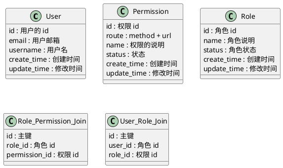

## uml 的设计

## 任务分解

### 权限的 crud

#### user

- [x] 接入 OAuth, 创建用户，返回 session
- [x] 获取用户信息（包含 role）
- [x] 更新用户信息
- [ ] 删除用户
  

- [ ] 为用户赋予 role
- [ ] 删除用户某一 role

#### role

- [ ] 创建 role
- [ ] 修改 role 信息
- [ ] 删除 role
  

- [ ] 查看 role 权限列表
- [ ] 增加 role 的权限
- [ ] 删除 role 的权限

#### permission

- [ ] 创建 permission
- [ ] 修改 permission 信息
- [ ] 删除 permission

## 一些经验

### error handler

